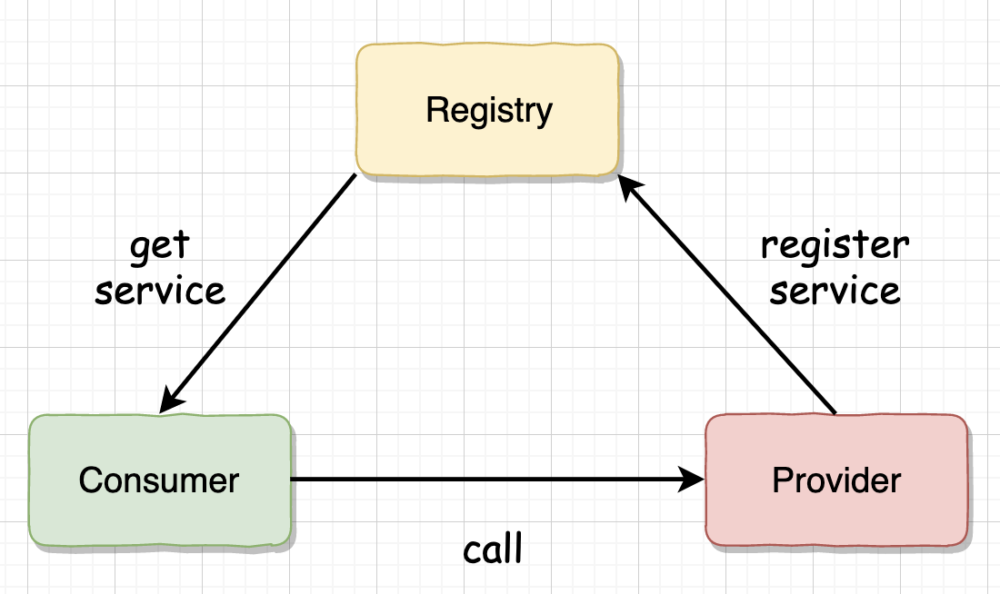
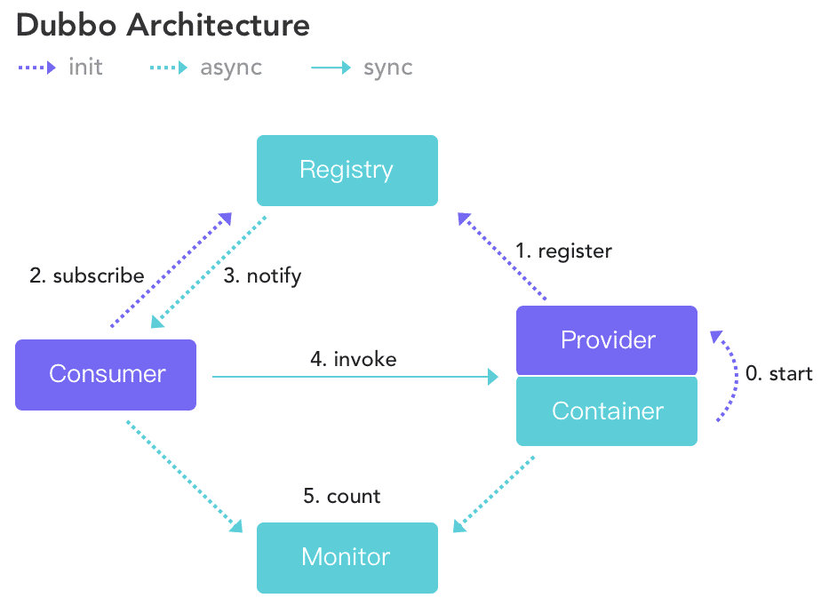
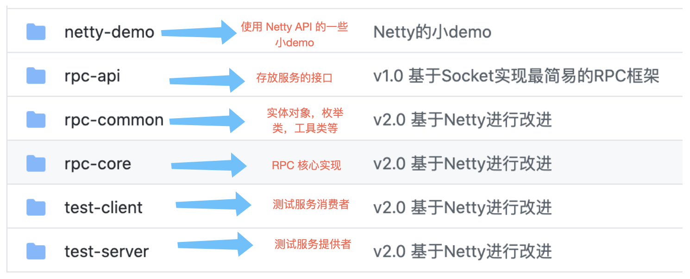

## simple-rpc-framework

***

### 前言


在当下的后端开发领域，分布式和微服务是非常热门的概念，它们也确实为大型企业项目提供了可行可靠的解决思路。不过此二者只是一种思想，或者说是一种架构概念，要想真正落地，还需要借助具体的技术或框架。之前自己在做练手项目的时候使用过 `Dubbo` 作为 RPC 框架，对相关的技术有了一定的了解，但是更多只是停留在对 API 的使用上，而没有去深究其原理。而本次要做的就是亲自动手去实现一个简易的 RPC 框架，不仅可以深入学习 RPC 的实现原理，也是不可多得的锻炼开发能力的机会。

### 简介

`simple-rcp-framework` 是一款基于 `Netty + Json/Kryo/Hessian + zookeeper` 的 RPC 框架，提供了多种序列化方案和简单的负载均衡算法，支持 `BIO` 和 `NIO` 两种 IO 模型。其架构示意图如下


> simple-rcp-framework 架构示意图

用过 `Dubbo` 的小伙伴可能会觉得这个图似曾相识。



> Dubbo 架构示意图

没错，本框架确实是借鉴了 `Dubbo` 的架构设计，不过功能和结构都要简单许多，相当于精简版的 `Dubbo`，只关注于核心的远程过程调用的实现，目前只在简单的测试环境中使用过。但是麻雀虽小，五脏俱全，`simple-rcp-framework` 虽然结构精简，但是也提供了比较丰富的功能，包含以下特性。

#### 特性

- 实现了基于 `Java` 原生 `Socket` 传输与 `Netty` 传输两种网络传输方式
- 实现了三种序列化方案，分别基于 `Json` 序列化，`Kryo` 序列化和 `Hessian` 序列化(默认采用 `Kryo`方式序列化)
- 实现了两种负载均衡算法：随机算法与轮转算法
- 使用 `Zookeeper` 作为注册中心，管理服务提供者信息
- 消费端如采用 `Netty` 方式，会复用 `Channel` 避免多次连接
- 如消费端和提供者都采用 `Netty` 方式，会采用 `Netty `的心跳机制，保证连接
- 接口抽象良好，模块耦合度低，网络传输、序列化器、负载均衡算法可配置
- 实现自定义的通信协议，可解决粘包问题
- 服务提供侧自动注册服务

### 自定义传输协议 (SRF协议)

在远程过程调用中，不管是消费方发出调用请求，还是服务方返回执行结果，数据都需要经过网络传输。本框架的通信模块是基于 `Netty` 的 `NIO` 通信，底层使用的是 `TCP` 协议，由于 `TCP` 自身的特点可能会导致粘包现象，Netty 虽然提供了一些常用的拆包器，例如 `FixedLengthFrameDecoder` 和 `LineBasedFrameDecoder` 等，但是无法满足我们的需求。所以需要自定义一个简单的传输协议，这里我们采用 SRF  (`simple-rcp-framework` 首字母)协议。格式如下：

```
+---------------+---------------+-----------------+-------------+
|  Magic Number |  Package Type | Serializer Type | Data Length |
|    4 bytes    |    4 bytes    |     4 bytes     |   4 bytes   |
+---------------+---------------+-----------------+-------------+
|                          Data Bytes                           |
|                   Length: ${Data Length}                      |
+---------------------------------------------------------------+
```

| 字段            | 解释                                                         |
| --------------- | ------------------------------------------------------------ |
| Magic Number    | 魔数，表识一个 SRF 协议包，0xCAFEBABE                        |
| Package Type    | 包类型，标明这是一个调用请求还是调用响应                     |
| Serializer Type | 序列化器类型，标明这个包的数据的序列化方式                   |
| Data Length     | 数据字节的长度                                               |
| Data Bytes      | 传输的对象，通常是一个`RpcRequest`或`RpcResponse`对象，取决于`Package Type`字段，对象的序列化方式取决于 Serializer Type 字段 |

### 项目主要模块概览



